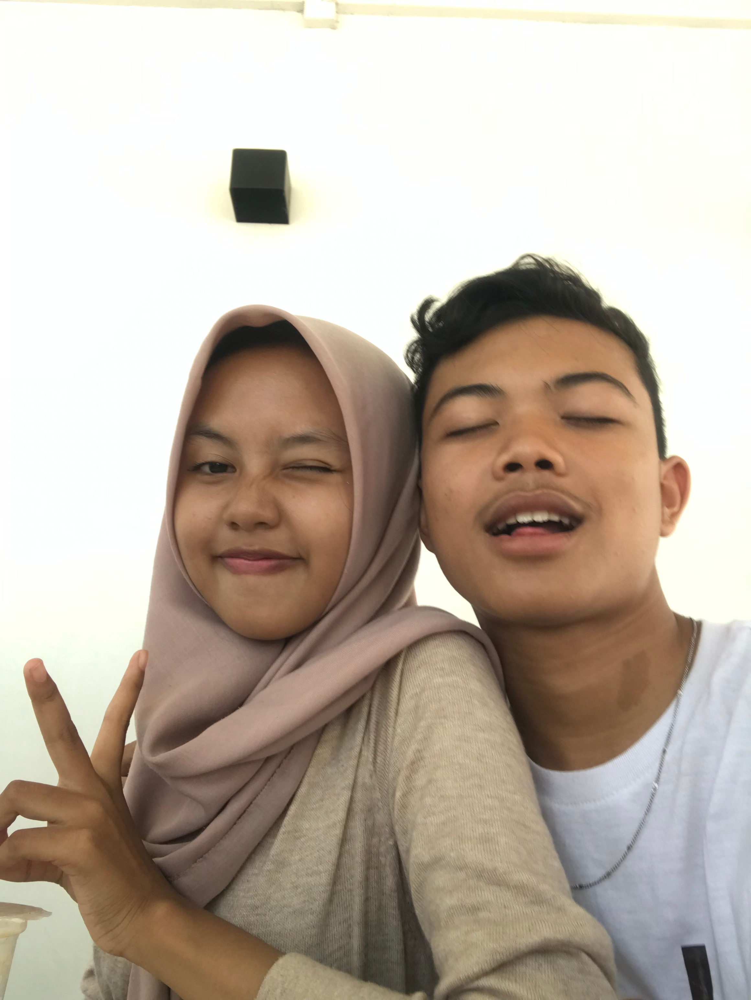

<!DOCTYPE html>
<html>
  <body>
    <h1>intaaaaaa masiii marahhh yaaa??</h1>
    
    <h1>maaafinnn ezaaaa yaaaaa??</h1>
    <button id="btn_mau" onclick="alert('trimakasiiii intaaaaa baikannn yaaaaa :D')">iya</button>&nbsp;
    <button id="btn_gamau" onclick="gamau(this)" style="position: absolute">
      ga
    </button>
  </body>
  
</html>
